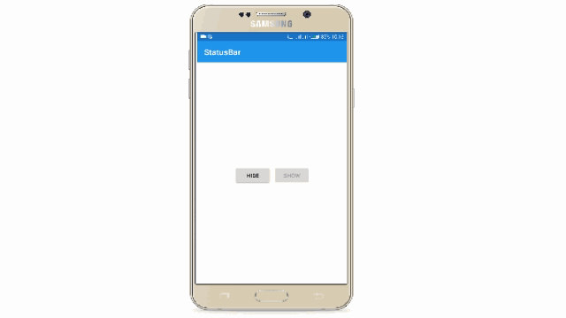
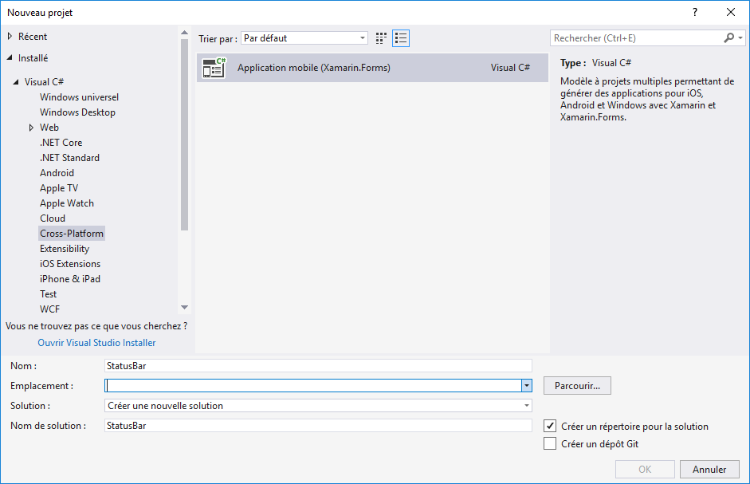
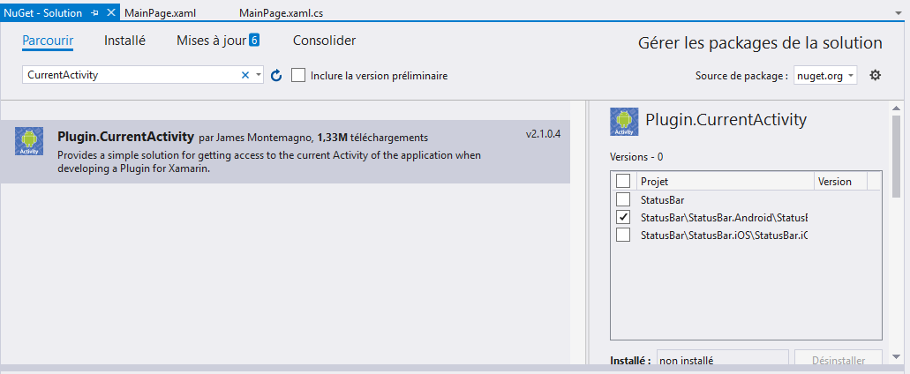
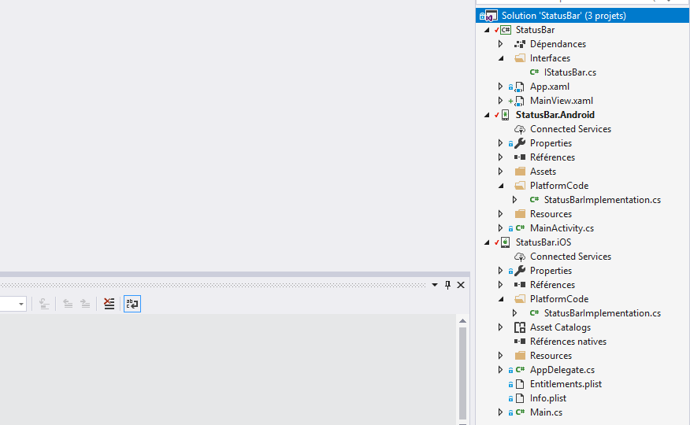

## Hide or show Smarphone's status Bar in Xamarin.Forms



### Lioncoding article Link

[Hide or show Smarphone's status](https://lioncoding.com/2019/03/15/2019-03-15-interagir-avec-la-barre-de-statut-du-smartphone-dans-xamarin-forms/)

### Create your project



### Add the following NuGet package to your Android project

- [Plugin.CurrentActivity](https://www.nuget.org/packages/Plugin.CurrentActivity/)

> This plugin gives developers and library creators easy access to an Android Application’s current Activity that is being displayed.



### Initialization

##### Android project

- MainActivity.cs

```csharp
protected override void OnCreate(Bundle savedInstanceState)
{
	TabLayoutResource = Resource.Layout.Tabbar;
	ToolbarResource = Resource.Layout.Toolbar;

	base.OnCreate(savedInstanceState);
	CrossCurrentActivity.Current.Init(this, savedInstanceState);
	global::Xamarin.Forms.Forms.Init(this, savedInstanceState);
	LoadApplication(new App());
}
```

### Project structure



### Interface to hide or show status bar

We will use DependencyService instead to access to the interface implementation.

```csharp
namespace StatusBar.Interfaces
{
    public interface IStatusBar
    {
        void HideStatusBar();
        void ShowStatusBar();
    }
}
```

### Interface implementation in Android project

```csharp
using Android.App;
using Android.Views;
using Plugin.CurrentActivity;
using StatusBar.Droid.PlatformCode;
using StatusBar.Interfaces;
using Xamarin.Forms;

[assembly: Dependency(typeof(StatusBarImplementation))]
namespace StatusBar.Droid.PlatformCode
{
    public class StatusBarImplementation : IStatusBar
    {
        public StatusBarImplementation()
        {

        }

        WindowManagerFlags _originalFlags;

        public void HideStatusBar()
        {
            Activity activity = CrossCurrentActivity.Current.Activity;
            var attrs = activity.Window.Attributes;
            _originalFlags = attrs.Flags;
            attrs.Flags |= WindowManagerFlags.Fullscreen;
            activity.Window.Attributes = attrs;
        }

        public void ShowStatusBar()
        {
            var activity = CrossCurrentActivity.Current.Activity;
            var attrs = activity.Window.Attributes;
            attrs.Flags = _originalFlags;
            activity.Window.Attributes = attrs;
        }
    }
}
```

### iOS implementation

```csharp
using StatusBar.Interfaces;
using StatusBar.iOS.PlatformCode;
using UIKit;
using Xamarin.Forms;

[assembly: Dependency(typeof(StatusBarImplementation))]
namespace StatusBar.iOS.PlatformCode
{
    public class StatusBarImplementation : IStatusBar
    {
        public StatusBarImplementation()
        {

        }

        public void HideStatusBar()
        {
            UIApplication.SharedApplication.StatusBarHidden = true;
        }

        public void ShowStatusBar()
        {
            UIApplication.SharedApplication.StatusBarHidden = false;
        }
    }
}
```

### Simple view

```xaml
<?xml version="1.0" encoding="utf-8" ?>
<ContentPage
    x:Class="StatusBar.MainView"
    xmlns="http://xamarin.com/schemas/2014/forms"
    xmlns:x="http://schemas.microsoft.com/winfx/2009/xaml"
    Title="StatusBar">

    <StackLayout
        HorizontalOptions="Center"
        Orientation="Horizontal"
        VerticalOptions="Center">

        <Button
            x:Name="HideStatusBarButton"
            Clicked="HideStatusBarButton_Clicked"
            Text="Hide" />
        <Button
            x:Name="ShowStatusBarButton"
            Clicked="ShowStatusBarButton_Clicked"
            Text="Show" />

    </StackLayout>

</ContentPage>
```

### Code behind

```csharp
using StatusBar.Interfaces;
using System;
using Xamarin.Forms;

namespace StatusBar
{
    public partial class MainView : ContentPage
    {
        public MainView()
        {
            InitializeComponent();
            ShowStatusBarButton.IsEnabled = false;
        }
       
        private void HideStatusBarButton_Clicked(object sender, EventArgs e)
        {
            DependencyService.Get<IStatusBar>().HideStatusBar();
            HideStatusBarButton.IsEnabled = false;
            ShowStatusBarButton.IsEnabled = true;
        }

        private void ShowStatusBarButton_Clicked(object sender, EventArgs e)
        {
            DependencyService.Get<IStatusBar>().ShowStatusBar();
            HideStatusBarButton.IsEnabled = true;
            ShowStatusBarButton.IsEnabled = false;
        }
    }
}
```

### Result

